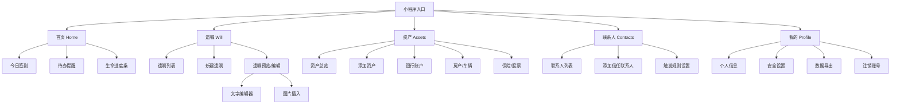

# 「身后事」小程序 · Claude Code + Figma 全流程开发指南

> 对标产品：死了么（数字遗嘱 / 身后事管理 / 生命纪念）
> 技术栈：微信小程序 + Node.js + MySQL + Figma + Claude Code
> 文档版本：v1.0 | 日期：2026-04-05

---

## 目录

1. [全流程总览](#全流程总览)
2. [Step 1 · 产品需求整理](#step-1--产品需求整理)
3. [Step 2 · PRD 文档输出](#step-2--prd-文档输出)
4. [Step 3 · 信息架构 & 用户旅程图](#step-3--信息架构--用户旅程图)
5. [Step 4 · ER 图设计](#step-4--er-图设计)
6. [Step 5 · 数据库 Schema 设计](#step-5--数据库-schema-设计)
7. [Step 6 · API 接口设计（契约先行）](#step-6--api-接口设计契约先行)
8. [Step 7 · UI 设计（Figma）](#step-7--ui-设计figma)
9. [Step 8 · 原型交互（Figma Prototype）](#step-8--原型交互figma-prototype)
10. [Step 9 · 前端开发（微信小程序）](#step-9--前端开发微信小程序)
11. [Step 10 · 后端开发（Node.js）](#step-10--后端开发nodejs)
12. [Step 11 · 测试](#step-11--测试)
13. [Step 12 · 部署上线](#step-12--部署上线)
14. [工具矩阵汇总](#工具矩阵汇总)
15. [Claude Code 在各环节的 Prompt 示例](#claude-code-在各环节的-prompt-示例)

---

## 全流程总览

```
需求收集 → PRD → 信息架构 → ER图 → Schema → API契约
                                              ↓
                                    Figma UI设计
                                              ↓
                                    Figma 原型交互
                                              ↓
                              前端开发 ←→ 后端开发
                                              ↓
                              单测 → 集成测试 → UAT
                                              ↓
                                      部署上线
```

| 步骤 | 主工具 | 辅助工具 | 产出物 |
|------|--------|----------|--------|
| 需求整理 | Claude Code | 竞品调研 | 需求清单.md |
| PRD | Claude Code | Notion/飞书 | PRD.md |
| 信息架构 | Claude Code + Figma | FigJam | IA图、用户旅程图 |
| ER图 | Claude Code + dbdiagram.io | drawio | ER.svg |
| Schema | Claude Code | MySQL Workbench | DDL.sql |
| API设计 | Claude Code | Apifox/Swagger | openapi.yaml |
| UI设计 | Figma | 设计系统 | 设计稿.fig |
| 原型交互 | Figma Prototype | 用户测试 | 可交互原型链接 |
| 前端 | Claude Code + VSCode | 微信开发者工具 | 小程序源码 |
| 后端 | Claude Code + VSCode | Postman | API服务源码 |
| 测试 | Claude Code + Jest | Playwright | 测试报告 |
| 部署 | Claude Code | 腾讯云 | 线上环境 |

---

## Step 1 · 产品需求整理

### 工具
- **Claude Code**（需求分析、竞品对比、用户故事提炼）
- 竞品：死了么 App、时光流逝、LastPass Emergency Kit

### 输入示例

```
用户对 Claude Code 说：

"帮我分析'死了么'类产品的核心功能，我要做一款微信小程序，
目标用户是 25-45 岁、有家庭责任感的人群，
核心价值是：帮用户提前安排好身后事，减少家人的困扰。
请列出 MVP 功能清单和后续迭代方向。"
```

### 输出示例

```markdown
## 竞品核心功能分析

### 死了么核心功能
| 功能模块 | 描述 |
|----------|------|
| 数字遗嘱 | 文字/视频遗嘱，身后触发发送 |
| 资产清单 | 银行卡、房产、保险登记 |
| 密码托管 | 加密存储账号密码 |
| 纪念馆 | 生前照片/故事归档 |
| 生命任务 | Bucket List，临终愿望清单 |

## 我们的差异化定位
- 微信生态原生（无需下载App）
- 情感化设计（温暖而非恐惧）
- 家庭协作（多人共同维护）

## MVP 功能清单（P0）
1. 用户注册/登录（微信授权）
2. 遗嘱编写（文字版）
3. 资产登记（分类归档）
4. 信任联系人设置（触发人）
5. 定期签到确认（防误触发）

## 后续迭代（P1/P2）
- 视频遗嘱
- AI 辅助遗嘱生成
- 律师公证对接
- 数字资产NFT托管
```

---

## Step 2 · PRD 文档输出

### 工具
- **Claude Code**（结构化 PRD 生成）
- Notion / 飞书文档（协作编辑）

### 输入示例

```
"基于上面的需求清单，帮我输出完整的 PRD 文档，
包含：产品背景、目标用户画像、功能规格说明、
非功能需求（性能/安全/隐私）、验收标准。"
```

### 输出示例（节选）

```markdown
# 「身后事」小程序 PRD v1.0

## 1. 产品背景
- 问题：用户去世后，家人无法获知其资产、意愿和重要信息
- 机会：微信月活12亿，小程序无安装门槛，隐私需求强烈

## 2. 目标用户画像
| 维度 | 描述 |
|------|------|
| 年龄 | 28-45岁 |
| 场景 | 刚婚育、有房贷、父母年迈 |
| 痛点 | 担心意外发生后家人手忙脚乱 |
| 动机 | 责任感驱动，非死亡焦虑 |

## 3. 核心功能规格

### 3.1 遗嘱编写
- 支持富文本编辑，最大 10000 字
- 支持插入图片（最多20张）
- 加密存储，AES-256
- 触发条件：信任联系人确认 + 90天未签到

### 3.2 资产登记
- 分类：银行账户、房产、车辆、保险、股票、其他
- 每类最多登记 20 条
- 支持附件上传（合同扫描件）

## 4. 非功能需求
- 接口响应 < 500ms（P95）
- 数据加密传输（HTTPS/TLS 1.3）
- 用户数据可导出、可删除（GDPR/个人信息保护法）
- 小程序包体积 < 2MB（分包加载）

## 5. 验收标准（AC）
- AC1: 用户完成遗嘱保存后，页面展示"已加密保存"提示
- AC2: 签到间隔超过90天，系统向信任联系人发送确认通知
```

---

## Step 3 · 信息架构 & 用户旅程图

### 工具
- **Figma FigJam**（白板绘制 IA 和旅程图）
- **Claude Code**（生成 Mermaid 图表，导入 FigJam）

### 输入示例

```
"帮我生成小程序的信息架构 Mermaid 图，
包含：首页、遗嘱、资产、联系人、我的 五个 Tab。"
```

### 输出示例



### Figma 操作
1. 打开 Figma → 新建 FigJam 文件
2. 插件：Mermaid to FigJam（粘贴上述代码自动生成）
3. 整理布局，添加颜色区分模块

---

## Step 4 · ER 图设计

### 工具
- **Claude Code**（生成 ER 描述和 dbdiagram.io DSL）
- **dbdiagram.io**（可视化 ER 图）

### 输入示例

```
"根据PRD功能，帮我设计数据库实体关系图，
输出 dbdiagram.io 格式的 DSL 代码。"
```

### 输出示例

```
// dbdiagram.io DSL

Table users {
  id          bigint [pk, increment]
  openid      varchar(64) [unique, not null]  // 微信 openid
  nickname    varchar(50)
  avatar_url  varchar(500)
  phone       varchar(20)
  status      tinyint [default: 1]            // 1正常 2注销
  last_checkin_at datetime
  created_at  datetime [default: `now()`]
  updated_at  datetime
}

Table wills {
  id          bigint [pk, increment]
  user_id     bigint [ref: > users.id]
  title       varchar(100) [not null]
  content     text                            // AES-256 加密存储
  status      tinyint [default: 0]            // 0草稿 1已发布 2已触发
  trigger_at  datetime                        // 触发时间
  created_at  datetime [default: `now()`]
  updated_at  datetime
}

Table will_attachments {
  id        bigint [pk, increment]
  will_id   bigint [ref: > wills.id]
  file_url  varchar(500)
  file_type varchar(20)                       // image/pdf/video
  file_size int
  created_at datetime
}

Table assets {
  id          bigint [pk, increment]
  user_id     bigint [ref: > users.id]
  category    varchar(30)                     // bank/property/vehicle/insurance/stock/other
  name        varchar(100)
  description text                            // 加密
  amount      decimal(15,2)
  attachments json                            // 附件URL数组
  created_at  datetime
  updated_at  datetime
}

Table trusted_contacts {
  id              bigint [pk, increment]
  user_id         bigint [ref: > users.id]
  contact_openid  varchar(64)
  contact_name    varchar(50)
  contact_phone   varchar(20)
  relation        varchar(20)                 // spouse/child/parent/friend
  notify_level    tinyint                     // 1=仅通知 2=可查看 3=全权限
  confirmed_at    datetime                    // 联系人确认时间
  created_at      datetime
}

Table checkins {
  id         bigint [pk, increment]
  user_id    bigint [ref: > users.id]
  checked_at datetime [not null]
  platform   varchar(20)                      // wechat/sms/email
}

Table trigger_records {
  id             bigint [pk, increment]
  user_id        bigint [ref: > users.id]
  trigger_type   varchar(30)                  // timeout/manual/emergency
  triggered_by   bigint [ref: > trusted_contacts.id]
  status         varchar(20)                  // pending/confirmed/cancelled
  created_at     datetime
  confirmed_at   datetime
}
```

### ER 关系说明

```
users 1──* wills           (一个用户多份遗嘱)
wills 1──* will_attachments (一份遗嘱多个附件)
users 1──* assets          (一个用户多条资产)
users 1──* trusted_contacts(一个用户多个信任联系人)
users 1──* checkins        (一个用户多次签到记录)
users 1──* trigger_records (一个用户多次触发记录)
trigger_records *──1 trusted_contacts (触发由联系人发起)
```

---

## Step 5 · 数据库 Schema 设计

### 工具
- **Claude Code**（生成完整 DDL SQL）
- MySQL Workbench（验证执行）

### 输入示例

```
"根据 ER 图，输出完整的 MySQL DDL 建表语句，
要求：InnoDB引擎、utf8mb4字符集、合理加索引、含注释。"
```

### 输出示例（节选）

```sql
-- 用户表
CREATE TABLE `users` (
  `id`              BIGINT UNSIGNED NOT NULL AUTO_INCREMENT COMMENT '用户ID',
  `openid`          VARCHAR(64)     NOT NULL COMMENT '微信openid',
  `nickname`        VARCHAR(50)     DEFAULT NULL COMMENT '昵称',
  `avatar_url`      VARCHAR(500)    DEFAULT NULL COMMENT '头像URL',
  `phone`           VARCHAR(20)     DEFAULT NULL COMMENT '手机号(加密)',
  `status`          TINYINT         NOT NULL DEFAULT 1 COMMENT '状态:1正常,2注销',
  `last_checkin_at` DATETIME        DEFAULT NULL COMMENT '最后签到时间',
  `created_at`      DATETIME        NOT NULL DEFAULT CURRENT_TIMESTAMP,
  `updated_at`      DATETIME        NOT NULL DEFAULT CURRENT_TIMESTAMP ON UPDATE CURRENT_TIMESTAMP,
  PRIMARY KEY (`id`),
  UNIQUE KEY `uk_openid` (`openid`),
  KEY `idx_status` (`status`),
  KEY `idx_last_checkin` (`last_checkin_at`)
) ENGINE=InnoDB DEFAULT CHARSET=utf8mb4 COMMENT='用户表';

-- 遗嘱表
CREATE TABLE `wills` (
  `id`          BIGINT UNSIGNED NOT NULL AUTO_INCREMENT COMMENT '遗嘱ID',
  `user_id`     BIGINT UNSIGNED NOT NULL COMMENT '用户ID',
  `title`       VARCHAR(100)    NOT NULL COMMENT '遗嘱标题',
  `content`     LONGTEXT        DEFAULT NULL COMMENT '遗嘱内容(AES-256加密)',
  `status`      TINYINT         NOT NULL DEFAULT 0 COMMENT '0草稿,1已发布,2已触发',
  `trigger_at`  DATETIME        DEFAULT NULL COMMENT '触发时间',
  `created_at`  DATETIME        NOT NULL DEFAULT CURRENT_TIMESTAMP,
  `updated_at`  DATETIME        NOT NULL DEFAULT CURRENT_TIMESTAMP ON UPDATE CURRENT_TIMESTAMP,
  PRIMARY KEY (`id`),
  KEY `idx_user_id` (`user_id`),
  KEY `idx_status` (`status`),
  CONSTRAINT `fk_will_user` FOREIGN KEY (`user_id`) REFERENCES `users` (`id`) ON DELETE CASCADE
) ENGINE=InnoDB DEFAULT CHARSET=utf8mb4 COMMENT='遗嘱表';
```

---

## Step 6 · API 接口设计（契约先行）

### 工具
- **Claude Code**（生成 OpenAPI 3.0 YAML）
- **Apifox**（导入 YAML，Mock 接口，团队协作）

### 输入示例

```
"根据 PRD 和数据库设计，生成 OpenAPI 3.0 格式的接口文档，
包含：用户模块、遗嘱模块、资产模块的完整 CRUD 接口，
使用 JWT Bearer Token 鉴权。"
```

### 输出示例

```yaml
openapi: 3.0.0
info:
  title: 身后事小程序 API
  version: 1.0.0
  description: 数字遗嘱与身后事管理服务

servers:
  - url: https://api.shenhoushe.com/v1
    description: 生产环境

security:
  - BearerAuth: []

components:
  securitySchemes:
    BearerAuth:
      type: http
      scheme: bearer
      bearerFormat: JWT

  schemas:
    Will:
      type: object
      properties:
        id:
          type: integer
        title:
          type: string
          maxLength: 100
        content:
          type: string
        status:
          type: integer
          enum: [0, 1, 2]
          description: "0草稿 1已发布 2已触发"
        created_at:
          type: string
          format: date-time

paths:
  /auth/login:
    post:
      summary: 微信登录
      requestBody:
        required: true
        content:
          application/json:
            schema:
              type: object
              properties:
                code:
                  type: string
                  description: 微信临时登录凭证
      responses:
        '200':
          description: 登录成功
          content:
            application/json:
              schema:
                type: object
                properties:
                  token:
                    type: string
                  user:
                    $ref: '#/components/schemas/User'

  /wills:
    get:
      summary: 获取遗嘱列表
      responses:
        '200':
          description: 成功
          content:
            application/json:
              schema:
                type: array
                items:
                  $ref: '#/components/schemas/Will'
    post:
      summary: 创建遗嘱
      requestBody:
        required: true
        content:
          application/json:
            schema:
              type: object
              required: [title]
              properties:
                title:
                  type: string
                content:
                  type: string
      responses:
        '201':
          description: 创建成功

  /wills/{id}:
    put:
      summary: 更新遗嘱
      parameters:
        - name: id
          in: path
          required: true
          schema:
            type: integer
      responses:
        '200':
          description: 更新成功
    delete:
      summary: 删除遗嘱
      responses:
        '204':
          description: 删除成功

  /checkin:
    post:
      summary: 用户签到（证明在世）
      responses:
        '200':
          description: 签到成功
          content:
            application/json:
              schema:
                type: object
                properties:
                  next_checkin_deadline:
                    type: string
                    format: date-time
```

### Apifox 操作
1. Apifox → 导入 → OpenAPI → 粘贴 YAML
2. 自动生成 Mock 接口（前后端可并行开发）
3. 接口变更时，先改 YAML，再通知前后端

---

## Step 7 · UI 设计（Figma）

### 工具
- **Figma**（主设计工具）
- **Claude Code**（生成设计规范、组件描述，辅助 Figma 插件）

### Figma 文件结构规范

```
📁 身后事小程序.fig
├── 📄 _Cover（封面）
├── 📄 _Design System（设计系统）
│   ├── Colors（色彩规范）
│   ├── Typography（字体规范）
│   ├── Spacing（间距规范）
│   └── Components（组件库）
│       ├── Button（按钮变体）
│       ├── Card（卡片）
│       ├── Input（输入框）
│       └── Navigation（导航栏）
├── 📄 Flow_01_Onboarding（引导流程）
├── 📄 Flow_02_Home（首页）
├── 📄 Flow_03_Will（遗嘱模块）
├── 📄 Flow_04_Assets（资产模块）
├── 📄 Flow_05_Contacts（联系人模块）
└── 📄 Flow_06_Profile（个人中心）
```

### Claude Code 输入（生成设计规范描述）

```
"帮我设计一套适合'身后事管理'小程序的色彩系统，
要求：温暖但不沉重、专业可信、适合中老年人，
输出：主色/辅助色/背景色/文字色的色值，以及使用场景说明。"
```

### Claude Code 输出（设计 Token）

```json
{
  "colors": {
    "primary": {
      "main": "#4A7C59",
      "light": "#6B9E7A",
      "dark": "#2D5A3D",
      "usage": "主按钮、重要操作、品牌色（自然绿，象征生命延续）"
    },
    "secondary": {
      "main": "#8B7355",
      "light": "#A89070",
      "usage": "次要操作、装饰元素（暖棕色，历史感与珍贵感）"
    },
    "background": {
      "page": "#F5F1EB",
      "card": "#FFFFFF",
      "usage": "页面底色（米白色，温暖不刺眼）"
    },
    "text": {
      "primary": "#2C2C2C",
      "secondary": "#666666",
      "placeholder": "#AAAAAA",
      "usage": "主文本/辅助文本/占位符"
    },
    "semantic": {
      "success": "#52C41A",
      "warning": "#FAAD14",
      "error": "#FF4D4F",
      "info": "#1890FF"
    }
  },
  "typography": {
    "title": { "size": "20px", "weight": "600", "lineHeight": "1.4" },
    "body":  { "size": "15px", "weight": "400", "lineHeight": "1.6" },
    "caption": { "size": "12px", "weight": "400", "lineHeight": "1.5" }
  },
  "spacing": {
    "xs": "4px", "sm": "8px", "md": "16px",
    "lg": "24px", "xl": "32px", "xxl": "48px"
  }
}
```

### Figma 关键页面设计要点

| 页面 | 设计要点 |
|------|----------|
| 引导页 | 用"给最爱的人留下什么"替代死亡主题，情感切入 |
| 首页 | 展示"生命任务完成度"进度条，积极框架 |
| 遗嘱编辑 | 类书信界面，温暖纸张质感背景 |
| 资产登记 | 清晰分类图标，表单简洁 |
| 触发确认 | 庄重设计，多重确认步骤防误操作 |

---

## Step 8 · 原型交互（Figma Prototype）

### 工具
- **Figma Prototype 功能**（连接页面交互流）
- **Claude Code**（生成交互说明文档）

### 输入示例

```
"帮我描述遗嘱编辑页面的完整交互逻辑，
包含：用户操作路径、过渡动画类型、边界条件处理。"
```

### 输出示例（交互说明文档）

```markdown
## 遗嘱编辑页交互规格

### 进入方式
- 从遗嘱列表点击「新建遗嘱」→ 底部弹出抽屉，高度 80vh
- 过渡动画：slide-up，时长 300ms，ease-out

### 核心交互
1. **标题输入**
   - 默认文字："给[nickname]的遗嘱"
   - 最大字符：50，实时显示剩余字数

2. **内容编辑器**
   - 工具栏：加粗/斜体/有序列表/插入图片
   - 键盘弹起时，工具栏随键盘浮动（position sticky）
   - 自动保存：输入停止 3 秒后静默保存，Toast 提示"已自动保存"

3. **发布操作**
   - 点击「发布」→ Modal 确认弹窗
   - 弹窗文案："发布后，您的遗嘱将在触发条件满足时发送给信任联系人，确认发布？"
   - 二次确认输入数字"88"（防误触）

### 边界条件
- 内容为空点击发布 → 抖动动画 + "请填写遗嘱内容"提示
- 网络断开时保存 → 本地缓存，网络恢复后同步，提示"离线模式"
- 超过字数限制 → 输入框变红，禁止继续输入

### Figma Prototype 连接
- Frame: Will_Edit → Tap "发布" → Overlay: Confirm_Modal
- Confirm_Modal → Tap "确认" → Will_Success（成功动画）
- 过渡效果：Smart Animate
```

### Figma Prototype 操作步骤
1. 选中按钮/热区 → 右侧面板 → Prototype
2. 设置触发：On Click → Navigate To → 目标 Frame
3. 选择动画：Smart Animate / Slide In / Dissolve
4. 右上角 ▶ 预览，或分享原型链接给干系人评审

---

## Step 9 · 前端开发（微信小程序）

### 工具
- **Claude Code**（代码生成、BUG修复、代码审查）
- **微信开发者工具**（调试、真机预览）
- **VSCode + 微信小程序插件**

### 项目结构

```
miniprogram/
├── app.js              # 全局逻辑
├── app.json            # 全局配置（tabBar/pages）
├── app.wxss            # 全局样式
├── pages/
│   ├── home/           # 首页（签到/概览）
│   ├── will/
│   │   ├── list/       # 遗嘱列表
│   │   └── edit/       # 遗嘱编辑
│   ├── assets/         # 资产管理
│   ├── contacts/       # 联系人
│   └── profile/        # 个人中心
├── components/
│   ├── will-card/      # 遗嘱卡片组件
│   ├── asset-item/     # 资产条目组件
│   └── checkin-btn/    # 签到按钮组件
├── utils/
│   ├── request.js      # 封装wx.request（自动带Token）
│   ├── crypto.js       # AES加解密工具
│   └── storage.js      # 本地缓存工具
└── config/
    └── index.js        # 环境配置
```

### 输入示例（Claude Code）

```
"帮我实现微信小程序的遗嘱编辑页（will/edit），
要求：
1. 使用 wx-editor 富文本组件
2. 3秒自动保存（防抖）
3. 内容AES加密后再调用保存接口
4. 发布时弹出二次确认弹窗
基于以下 API 接口：
POST /wills（创建）
PUT /wills/:id（更新）"
```

### 输出示例（关键代码）

```javascript
// pages/will/edit/edit.js
const { encrypt, decrypt } = require('../../../utils/crypto')
const request = require('../../../utils/request')

Page({
  data: {
    willId: null,
    title: '',
    content: '',
    isSaving: false,
    showConfirmModal: false,
  },

  onLoad(options) {
    if (options.id) {
      this.setData({ willId: options.id })
      this.loadWill(options.id)
    }
    // 初始化富文本编辑器
    this.editorCtx = null
  },

  onEditorReady() {
    wx.createSelectorQuery()
      .select('#editor')
      .context(res => { this.editorCtx = res.context })
      .exec()
  },

  onInput: debounce(function(e) {
    this.setData({ content: e.detail.html })
    this.autoSave()
  }, 3000),

  async autoSave() {
    if (!this.data.title) return
    this.setData({ isSaving: true })
    const encryptedContent = encrypt(this.data.content)
    try {
      if (this.data.willId) {
        await request.put(`/wills/${this.data.willId}`, {
          title: this.data.title,
          content: encryptedContent
        })
      } else {
        const res = await request.post('/wills', {
          title: this.data.title,
          content: encryptedContent,
          status: 0 // 草稿
        })
        this.setData({ willId: res.data.id })
      }
      wx.showToast({ title: '已自动保存', icon: 'success', duration: 1500 })
    } finally {
      this.setData({ isSaving: false })
    }
  },

  onPublishTap() {
    if (!this.data.content) {
      wx.showToast({ title: '请填写遗嘱内容', icon: 'error' })
      return
    }
    this.setData({ showConfirmModal: true })
  },

  async onConfirmPublish() {
    await request.put(`/wills/${this.data.willId}`, { status: 1 })
    this.setData({ showConfirmModal: false })
    wx.navigateBack()
    wx.showToast({ title: '遗嘱已发布', icon: 'success' })
  }
})

function debounce(fn, delay) {
  let timer = null
  return function(...args) {
    clearTimeout(timer)
    timer = setTimeout(() => fn.apply(this, args), delay)
  }
}
```

---

## Step 10 · 后端开发（Node.js）

### 工具
- **Claude Code**（API 实现、中间件、业务逻辑）
- **Express.js + Sequelize ORM + MySQL**
- **腾讯云 COS**（文件存储）

### 项目结构

```
server/
├── src/
│   ├── controllers/
│   │   ├── authController.js    # 微信登录/JWT
│   │   ├── willController.js    # 遗嘱 CRUD
│   │   ├── assetController.js   # 资产 CRUD
│   │   └── checkinController.js # 签到逻辑
│   ├── models/
│   │   ├── User.js
│   │   ├── Will.js
│   │   └── Asset.js
│   ├── middleware/
│   │   ├── auth.js              # JWT验证中间件
│   │   ├── encrypt.js           # 字段加解密中间件
│   │   └── rateLimit.js         # 接口限流
│   ├── services/
│   │   ├── wechatService.js     # 微信API调用
│   │   ├── cryptoService.js     # AES加解密服务
│   │   └── triggerService.js    # 触发检测定时任务
│   ├── routes/
│   │   └── index.js
│   └── app.js
├── .env
└── package.json
```

### 输入示例（Claude Code）

```
"实现签到超时触发逻辑：
- 每天凌晨2点定时扫描，找出超过90天未签到的用户
- 向其信任联系人发送微信模板消息
- 若联系人48小时内确认，则将用户遗嘱状态改为'已触发'，
  并通过微信订阅消息推送给联系人
用 node-cron 实现定时任务。"
```

### 输出示例

```javascript
// services/triggerService.js
const cron = require('node-cron')
const { User, Will, TrustedContact, TriggerRecord } = require('../models')
const { Op } = require('sequelize')
const wechatService = require('./wechatService')

// 每天凌晨 2:00 执行
cron.schedule('0 2 * * *', async () => {
  console.log('[TriggerService] 开始扫描超时用户...')

  const ninetyDaysAgo = new Date(Date.now() - 90 * 24 * 60 * 60 * 1000)

  const overdueUsers = await User.findAll({
    where: {
      status: 1,
      last_checkin_at: { [Op.lt]: ninetyDaysAgo }
    },
    include: [{
      model: TrustedContact,
      where: { confirmed_at: { [Op.ne]: null } }
    }]
  })

  for (const user of overdueUsers) {
    // 避免重复触发
    const existing = await TriggerRecord.findOne({
      where: {
        user_id: user.id,
        status: ['pending', 'confirmed']
      }
    })
    if (existing) continue

    // 创建触发记录
    const record = await TriggerRecord.create({
      user_id: user.id,
      trigger_type: 'timeout',
      status: 'pending'
    })

    // 通知所有信任联系人
    for (const contact of user.TrustedContacts) {
      await wechatService.sendTemplateMessage({
        touser: contact.contact_openid,
        template_id: process.env.WX_TEMPLATE_ID_TRIGGER,
        data: {
          name: { value: user.nickname },
          deadline: { value: formatDate(new Date(Date.now() + 48 * 3600 * 1000)) },
          action: { value: '点击确认' }
        },
        miniprogram: {
          appid: process.env.WX_APPID,
          pagepath: `pages/trigger/confirm?record_id=${record.id}`
        }
      })
    }

    console.log(`[TriggerService] 已通知用户 ${user.id} 的 ${user.TrustedContacts.length} 位联系人`)
  }
})
```

---

## Step 11 · 测试

### 工具
- **Claude Code**（生成测试用例、测试代码）
- **Jest**（单元测试 + 集成测试）
- **Playwright**（E2E 测试，模拟小程序页面）
- **Postman / Apifox**（接口测试）

### 测试层次

```
E2E 测试（Playwright）         ← 少而精，覆盖核心流程
    ↑
集成测试（Jest + supertest）   ← 接口级别测试
    ↑
单元测试（Jest）               ← 工具函数、业务逻辑
```

### 输入示例（Claude Code）

```
"为 triggerService.js 编写单元测试，
覆盖：正常触发、已有pending记录不重复触发、用户无联系人跳过 三个场景。
使用 Jest + Mock，不真实调用数据库和微信API。"
```

### 输出示例

```javascript
// tests/triggerService.test.js
const { checkAndTrigger } = require('../src/services/triggerService')

// Mock 数据库模型
jest.mock('../src/models', () => ({
  User: {
    findAll: jest.fn()
  },
  TriggerRecord: {
    findOne: jest.fn(),
    create: jest.fn()
  }
}))

jest.mock('../src/services/wechatService', () => ({
  sendTemplateMessage: jest.fn().mockResolvedValue({ errcode: 0 })
}))

const { User, TriggerRecord } = require('../src/models')
const wechatService = require('../src/services/wechatService')

describe('TriggerService - checkAndTrigger', () => {
  beforeEach(() => {
    jest.clearAllMocks()
  })

  test('正常情况：创建触发记录并通知联系人', async () => {
    User.findAll.mockResolvedValue([{
      id: 1,
      nickname: '张三',
      TrustedContacts: [{ contact_openid: 'openid_001', confirmed_at: new Date() }]
    }])
    TriggerRecord.findOne.mockResolvedValue(null)
    TriggerRecord.create.mockResolvedValue({ id: 100 })

    await checkAndTrigger()

    expect(TriggerRecord.create).toHaveBeenCalledTimes(1)
    expect(wechatService.sendTemplateMessage).toHaveBeenCalledTimes(1)
  })

  test('已有 pending 记录：跳过，不重复触发', async () => {
    User.findAll.mockResolvedValue([{
      id: 2,
      nickname: '李四',
      TrustedContacts: [{ contact_openid: 'openid_002', confirmed_at: new Date() }]
    }])
    TriggerRecord.findOne.mockResolvedValue({ id: 99, status: 'pending' }) // 已存在

    await checkAndTrigger()

    expect(TriggerRecord.create).not.toHaveBeenCalled()
    expect(wechatService.sendTemplateMessage).not.toHaveBeenCalled()
  })

  test('用户无已确认联系人：跳过', async () => {
    User.findAll.mockResolvedValue([{
      id: 3,
      nickname: '王五',
      TrustedContacts: [] // 空
    }])
    TriggerRecord.findOne.mockResolvedValue(null)

    await checkAndTrigger()

    expect(TriggerRecord.create).not.toHaveBeenCalled()
  })
})
```

### 测试覆盖目标

| 类型 | 覆盖率目标 | 重点 |
|------|-----------|------|
| 单元测试 | > 80% | 加解密、触发逻辑、权限判断 |
| 接口测试 | 100% Happy Path | 所有 CRUD 接口 |
| E2E 测试 | 核心流程 5 条 | 登录→写遗嘱→发布→签到→触发 |

---

## Step 12 · 部署上线

### 工具
- **Claude Code**（生成 Dockerfile、CI/CD 配置）
- **腾讯云 CVM / 容器服务 TKE**
- **微信开发者工具**（小程序审核提交）

### 输入示例

```
"帮我生成 Node.js 后端的 Dockerfile 和
GitHub Actions CI/CD 配置，
要求：构建镜像 → 运行测试 → 推送到腾讯云 TCR → 部署到 CVM。"
```

### 输出示例（Dockerfile）

```dockerfile
# 构建阶段
FROM node:18-alpine AS builder
WORKDIR /app
COPY package*.json ./
RUN npm ci --only=production

# 运行阶段
FROM node:18-alpine
WORKDIR /app
COPY --from=builder /app/node_modules ./node_modules
COPY src ./src
COPY .env.production .env

EXPOSE 3000
HEALTHCHECK --interval=30s --timeout=3s \
  CMD wget -q -O - http://localhost:3000/health || exit 1

CMD ["node", "src/app.js"]
```

### 上线检查清单

```markdown
## 发布前 Checklist

### 安全
- [ ] 所有敏感字段（手机号/遗嘱内容/资产信息）已加密存储
- [ ] JWT 密钥已设置为强随机字符串（> 32位）
- [ ] HTTPS 已配置，HTTP 自动重定向
- [ ] 接口限流已启用（登录接口 10次/分钟）
- [ ] SQL 注入防护（使用 ORM 参数化查询）

### 性能
- [ ] 数据库索引已按查询优化
- [ ] 图片/附件走 CDN（腾讯云 COS + CDN）
- [ ] 接口响应 P95 < 500ms（压测验证）

### 小程序
- [ ] 小程序隐私协议已填写
- [ ] 用户数据收集已在小程序管理后台声明
- [ ] 审核材料：截图 + 功能说明 + 测试账号
- [ ] 分包加载配置（主包 < 1.5MB）
```

---

## 工具矩阵汇总

| 环节 | 主工具 | 输入 | 输出 | 与下一步衔接 |
|------|--------|------|------|-------------|
| 需求整理 | Claude Code | 竞品名称、目标用户描述 | 功能清单.md | → PRD |
| PRD | Claude Code | 功能清单 | PRD.md（结构化）| → 技术设计 |
| 信息架构 | Figma FigJam | PRD功能列表 | IA图、旅程图 | → UI设计 |
| ER图 | Claude Code + dbdiagram | PRD实体描述 | ER.svg | → Schema |
| Schema | Claude Code + MySQL | ER图 | DDL.sql | → 后端开发 |
| API设计 | Claude Code + Apifox | PRD接口需求 | openapi.yaml | → 前后端并行 |
| UI设计 | Figma | 设计规范 + IA图 | 设计稿.fig | → 原型 + 前端 |
| 原型交互 | Figma Prototype | 设计稿 + 交互说明 | 原型链接 | → 用户评审 |
| 前端开发 | Claude Code + 微信工具 | 设计稿 + API文档 | 小程序源码 | → 联调 |
| 后端开发 | Claude Code + VSCode | API文档 + Schema | Node.js 源码 | → 联调 |
| 测试 | Claude Code + Jest | 源码 + AC验收标准 | 测试报告 | → 修复 → 发布 |
| 部署 | Claude Code + 腾讯云 | 源码 + 配置 | 线上环境 | → 监控 |

---

## Claude Code 在各环节的 Prompt 示例

### 通用提示技巧

```markdown
# 高效 Prompt 模板

## 需求类
"你是一名产品经理，帮我[任务]，
背景：[项目背景]，
约束：[限制条件]，
输出格式：[Markdown表格/JSON/代码块]"

## 代码生成类
"基于以下上下文：
- 技术栈：[栈]
- 现有代码：[粘贴代码]
- API文档：[接口描述]
帮我实现[功能]，要求：[具体要求]"

## 代码审查类
"审查以下代码，关注：
1. 安全漏洞（OWASP Top 10）
2. 性能问题
3. 边界条件处理
[粘贴代码]"
```

### 最高价值的 Claude Code 使用场景

1. **快速生成样板代码**：ER图→DDL、OpenAPI→控制器骨架
2. **业务逻辑实现**：触发检测、加解密流程
3. **测试用例生成**：给函数签名，生成完整测试
4. **代码审查**：安全检查、性能优化建议
5. **文档生成**：代码→API文档、注释补全

---

## 附录：推荐工具链

| 类别 | 工具 | 用途 |
|------|------|------|
| 设计 | Figma | UI/原型/设计系统 |
| AI编码 | Claude Code | 全流程辅助 |
| 接口管理 | Apifox | API设计/Mock/测试 |
| 数据库设计 | dbdiagram.io | ER图可视化 |
| 数据库工具 | MySQL Workbench | DDL执行/数据管理 |
| 版本控制 | GitHub | 代码托管/CI/CD |
| 测试 | Jest + Playwright | 单测/E2E |
| 云服务 | 腾讯云 | CVM/COS/CDN/微信生态 |
| 监控 | 腾讯云可观测/Sentry | 错误监控/性能监控 |
| 协作 | 飞书/Notion | PRD/需求管理 |

---

*文档生成：Claude Code (claude-sonnet-4-6) | 日期：2026-04-05*
